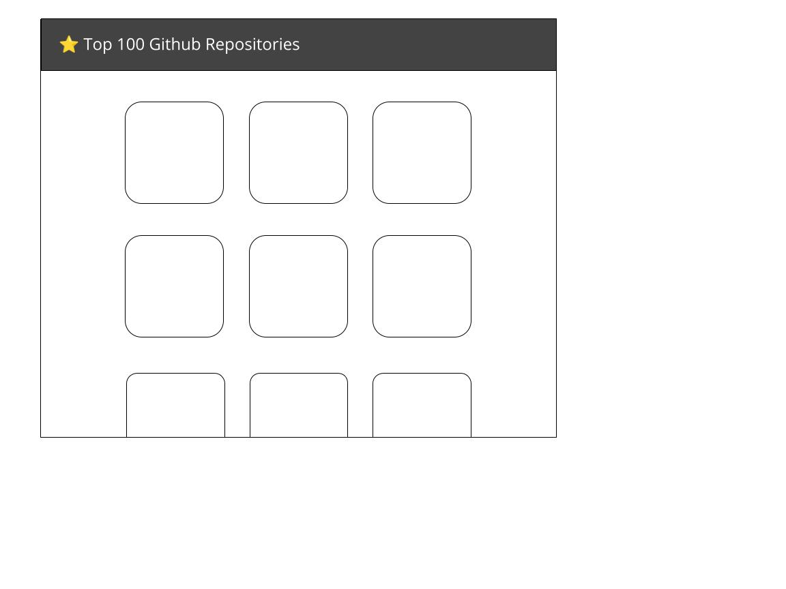
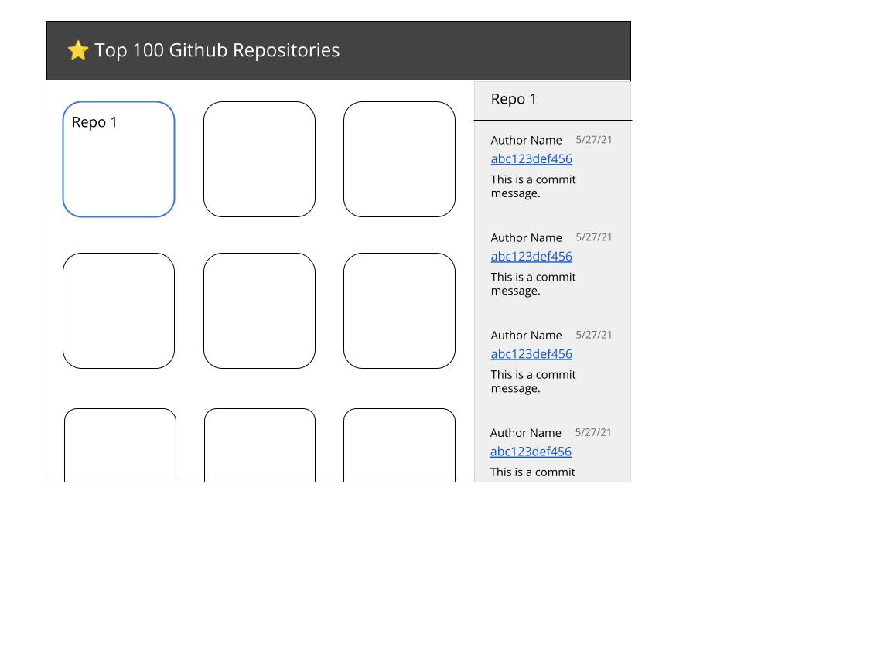
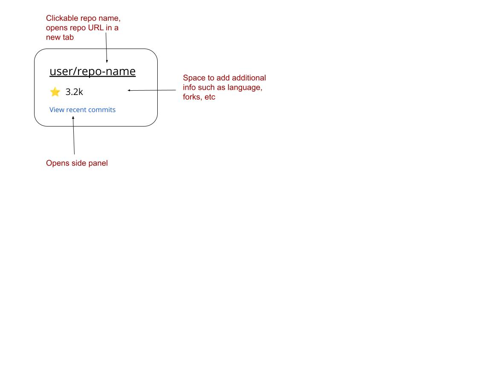

# App Design

## MVP Requirements
* Display top 100 most starred Github repos in card form
* For each repo, show commits made in the last 24 hours
  * Repo data:
    * Repo name
    * Repo url
    Star count
  * Commit data:
    * Author name
    * Commit date
    * Commit message

Potential extensions:
* Repo cards
  * Add data:
    * Primary language
    * Last updated date
    * Number of open pull requests
    * Number of open repos
  * Commit display
    * Add data:
      * Commit hash with link
      * Long commit messages should be shortened with an option to expand and read more

## Design Process

### Stack

* React via create-react-app
  * Considering this is a small site with minimal data/user interaction, Next.JS would have been a good consideration. However, given the time constraint and my familiarity with React, I chose to use that over Next.js. 
* Typescript
* SCSS
* octokit for easy github data fetching
* Testing:
  * Jest
  * React Testing Library
  * Mock Service Worker

### UX Thoughts
* Make commits available via a click.
* Commit rendering options (not in any particular order) 
  * Modal
  * Separate route 
  * Side tray that slides out on click
    * This is my initial preference. Keeps the UI clean without having to jump to a separate page to view the commits. 
    If we pad the page properly, sliding out a tray from the right hand side shouldn’t mess with the card layout. 

## Wireframes

### Layout

### Card

Design Process: 25 minutes
